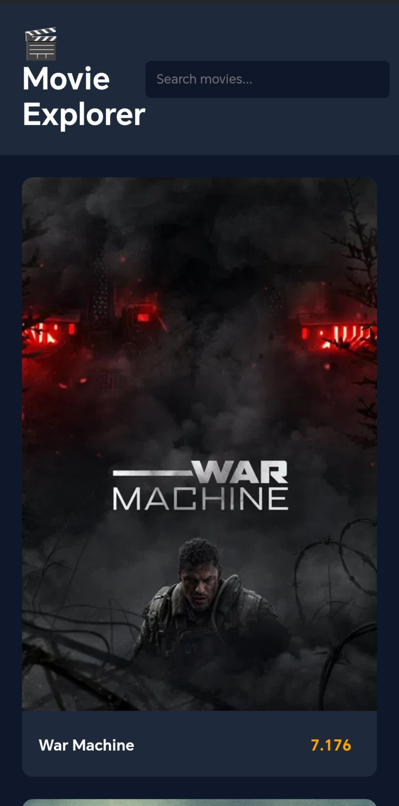

# 🎬 Movie Explorer App

A modern movie search web application built with **HTML, CSS, and JavaScript** using the **TMDB API**.

Users can search for movies and view posters, ratings, and descriptions.

---

## 🌐 Live Demo

https://semo1682.github.io/movie-explorer-app/

---

## 🚀 Features

- Search for movies
- Display movie posters
- Show ratings and descriptions
- Responsive design
- Clean and modern UI

---

## 🛠 Technologies Used

- HTML5
- CSS3
- JavaScript
- TMDB API

---

## 📸 Preview

---

## 👨‍💻 Author

**Eslam Mesalam**

Front-End Developer
